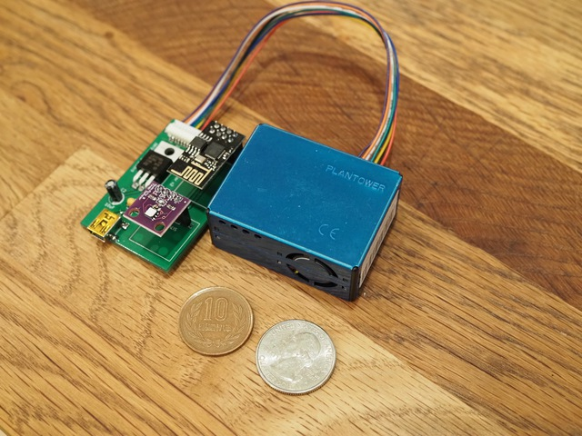
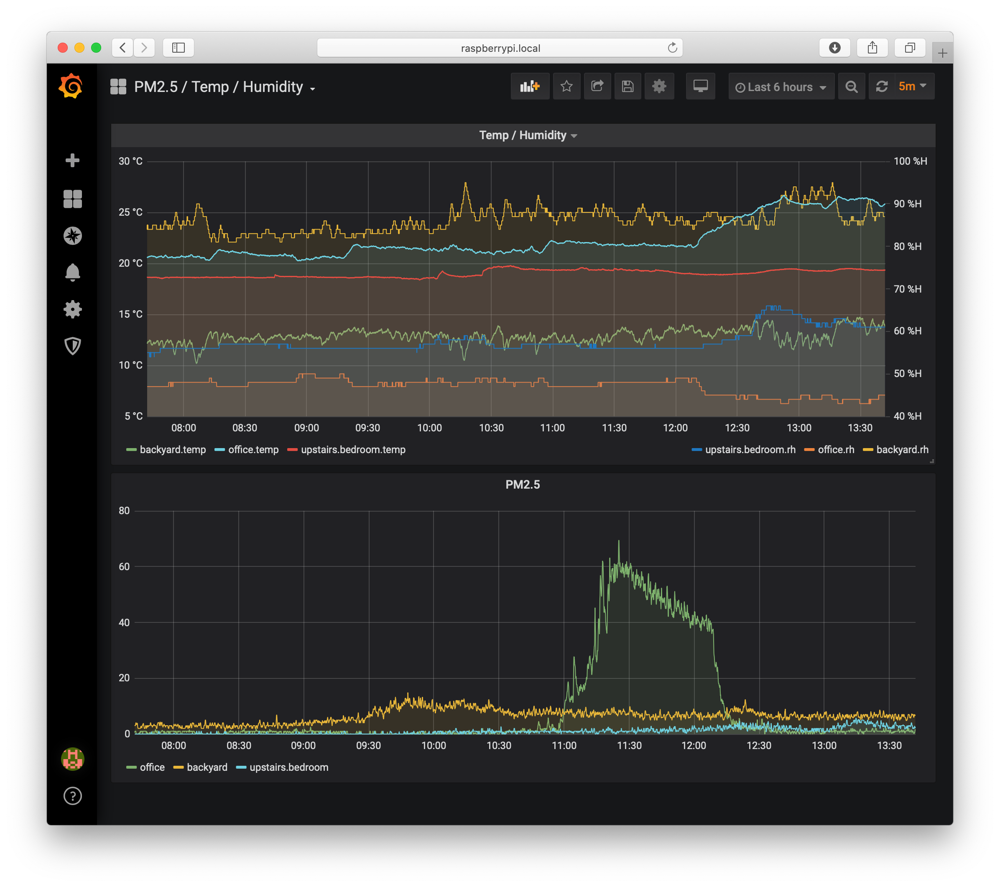

# My ESP8266 + Plantower AQ sensor project

This project is an ESP8266 combined with an AQ sensor and temp / humidity sensor.
I have these set up around my house so I can monitor air quality and temp.
It broadcasts the sensor information over UDP, and anything listening for the
UDP broadcasts can decode the information and use it.

## Overview

Here is a photo of the completed project:

The sensor gets power over USB.  When you power the sensor up, it will create
an ad-hoc wifi network.  You can connect to that network then configure the
sensor with the network you want it to connect to.

## Hardware

The PCB is found in the [pcb](pcb) directory.  It's just a Kicad project.  The
[README](pcb/README.md) in that folder has more information about the hardware
side of this project (including parts, etc).

## Firmware

The firmware is found in the [firmware](firmware) directory.  The
[README](firmware/README.md) file in that folder has more information about the
firmware side of this project.

## Client

There is a sample client in `client.rb`.  It will listen for sensor data then
print it to the terminal.  You should decide what to do with that data.
Personally, I am feeding it in to an InfluxDB and then using Grafana to plot
the data:

